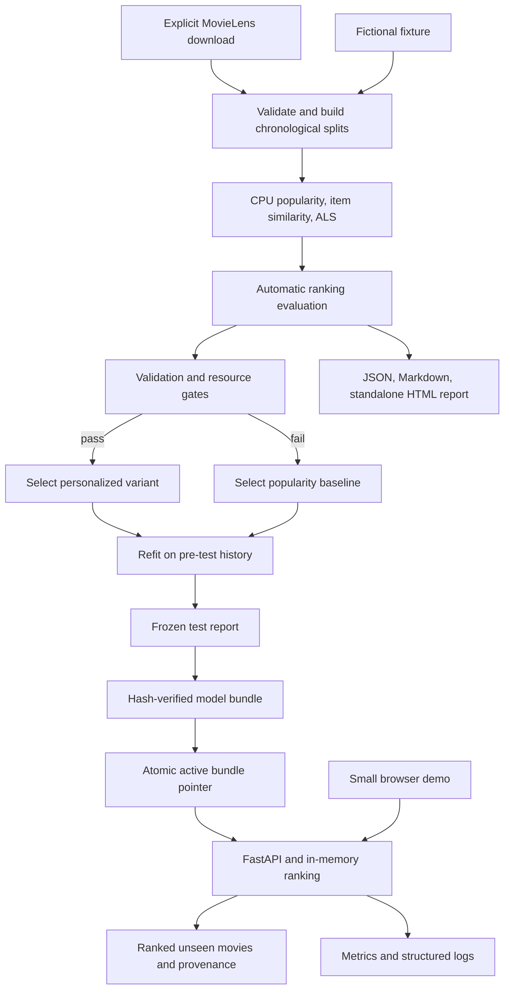

# CPU Recommendation Service

## 1. Executive summary

Build a local movie recommendation service that learns preferences from historical ratings, ranks unseen movies, and serves recommendations through a typed API and a small browser demo. Compare popularity, item similarity, and CPU matrix factorization on a chronological benchmark. Publish ranking quality, cold-start results, latency, memory, and automatic model-selection decisions.

The engineering question is: **Can personalization improve discovery over popularity while preserving fast, reliable serving on an ordinary CPU?** The portfolio contribution is recommendation and ranking engineering with objective evaluation and a complete product workflow.

**Draft architecture, October 5, 2026.** Target: **12–16 engineer-days**, including tests, benchmark evidence, documentation, and contingency. One engineer-day means six focused hours. This is about 2.5–3.5 full-time working weeks or 5–6.5 weeks at 15 focused hours/week. First working demo: day 4–5. Commands and performance thresholds below are proposed interfaces and objectives; implementation and measurements have not started.

Training, inference, evaluation, and CI use CPU only. There is no local language model, hosted model API, human labeling, review queue, approval workflow, or manual quality assessment required for v1 completion. Dataset download and dependency installation are explicit setup steps; subsequent runs work offline. Cloud/API spend is zero, with local hardware and electricity recorded separately.

### Portfolio rationale

The [September 6 research report](../../deep-research-report-us-sr-ai-engr.md) identifies production engineering and evaluation/observability in all 12 sampled postings, and proposes a Production Recommender System using MovieLens. Recommendation is an additional specialization after the portfolio's existing agent, retrieval, security, and data-platform work. This is a portfolio judgment based on that research snapshot, rather than a claim about vacancies still open in October.

| Existing project | Current README evidence and scope | Incremental contribution here |
|---|---|---|
| [Deep Research](../../deep-research/README.md) | Bounded research agents, plan approval, cited outputs, measured development cost; broader cloud architecture exceeds delivered scope | Personalized ranking from historical behavior and labels that can be scored automatically |
| [RAG Evaluation Platform](../../rag-eval-platform/README.md) | Retrieval benchmarks, generation/judge tooling, regression gates and telemetry; human judge calibration is deferred | User/item recommendation, cold-start handling, and ranking evaluation without judges |
| [Real-Time ML Platform](../../realtime-ml-platform/README.md) | Delivered batch training and Kubernetes prediction serving; live feature production and retraining remain future work | Recommendation quality and discovery trade-offs with a much smaller deployment |
| [Secure Agent Platform](../../secure-agent-platform/README.md) | Authorization, isolated tools, durable execution, and a completed release evaluation with a failed utility gate | A bounded numerical model whose useful outcomes need no tool approvals or generation trials |
| [Document Intelligence Workbench](../../document-intelligence-workbench/README.md) | Extraction, page evidence, revisions, mandatory approval and experimental evaluation; full acceptance remains pending | A workflow that completes automatically using existing rating labels |

The older plans describe intended architectures; their READMEs establish the current implemented scope. The new service remains independently runnable and does not require finishing any existing project's backlog.

### Alternatives considered

| Candidate | Fit with the constraints | Decision |
|---|---|---|
| CPU recommendation service | Existing numerical labels, lightweight training, visible personalization, objective ranking metrics | Select for v1 |
| Responsible credit-risk service | CPU-friendly, but responsible-use claims and dataset-specific subgroup analysis require additional scope | Defer as a separate specialization |
| Coding-agent benchmark | Automatic test grading is possible, but local inference, repository environments, and sandbox maintenance increase effort | Defer |
| LLM routing/cost gateway | Could use hosted inference, but adds provider dependence and overlaps existing cost/evaluation infrastructure | Defer |

### Goals and scope boundary

Deliver three comparable ranking variants, a recommendation API, cold-start fallback, a thin demo, automatically generated reports, automated promotion/rejection, rollback, CPU container packaging, and CI.

Keep v1 to one dataset, one application process, one offline CLI pipeline, and local model bundles. Exclude neural recommenders, LLM explanations, fine-tuning, a separately learned reranker, live ingestion, Redis, Postgres, MLflow, Kafka, Kubernetes, Terraform, distributed jobs, and online A/B experiments. These exclusions are what make the shorter timeline credible. There is no revenue, click-through-rate, or user-productivity uplift claim from an offline ratings benchmark.

## 2. User experience and workflow

The browser demo has one screen: select a benchmark profile or choose up to ten liked movies, optionally filter by genre, and receive ten recommendations. Display the ranking variant, model version, fallback reason, and a short deterministic reason code. Compare the same request against popularity. Use movie titles and genres from the local catalog; posters, external movie APIs, and generated prose are unnecessary.

The default fictional fixture supports a complete runnable demo without downloading MovieLens. After explicit dataset setup, the real profile uses fresh CPU inference from a trained bundle. Fixture results and real-dataset results remain visibly distinct in the browser and reports.

Proposed workflow:

```bash
make setup                    # Install locked CPU dependencies
make check                    # Offline fixture tests and ranking canary
make demo-fixture              # Train/serve a tiny fictional dataset
make data-fetch                # Explicit MovieLens download and verification
make benchmark                # Development selection and final frozen report
make dev                      # Serve the selected real-data bundle
make showcase                 # Verify bundle, run API/fault/load checks, export evidence
```

`make benchmark` selects a variant by automatic development gates. It produces a complete report even when personalization fails its objective. Failed selection serves the popularity baseline and records the decision. No step pauses for a reviewer to accept predictions, label examples, or approve a model.

```text
FETCHED -> VALIDATED -> SPLIT -> TRAINED -> VALIDATION_SCORED
    -> SELECTED_OR_BASELINE -> FINAL_REFIT -> TEST_REPORTED -> BUNDLED
```

Failures produce a typed failure report and nonzero exit. A rejected candidate never overwrites the current serving bundle. Training and evaluation run in the CLI, outside API requests; interrupted training can restart because the workload is deliberately small.

## 3. System architecture



### Components

| Component | Choice | Responsibility |
|---|---|---|
| Application and CLI | Python 3.12, FastAPI, Pydantic v2, Typer | Validated requests, offline pipeline, serving and reports |
| Numerical processing | NumPy and SciPy sparse matrices | Interaction matrices, exact scoring, item similarities and metrics |
| Personalized model | `implicit.cpu.als.AlternatingLeastSquares` | CPU-only collaborative factor training and user fold-in |
| Persistence | Immutable local bundles, JSON manifests, NPZ/CSR files | Versioned models, catalog, histories, split and run identities |
| Browser demo | Server-served HTML/CSS/JavaScript | Preference selection, baseline comparison and provenance |
| Evaluation | Python library shared by CLI and CI | Full-catalog ranking metrics, paired comparisons and gates |
| Operations | Structured JSON logs and Prometheus endpoint | Request/stage latency, failures, fallback and model selection |
| Packaging | Non-root CPU Docker image; GitHub Actions | Reproducible installation, tests, image build and evidence validation |

The [upstream CPU ALS API](https://benfred.github.io/implicit/api/models/cpu/als.html) accepts user-by-item CSR confidence matrices and supports recalculating a user representation without modifying stored factors. Import the CPU implementation directly; do not use a factory that can automatically select GPU execution.

### Ranking variants

| Variant | Training and scoring | Role |
|---|---|---|
| `popularity` | Count positive pre-cutoff ratings per movie; deterministic ID tie-break | Strong, cheap non-personalized baseline and fallback |
| `item_knn` | Cosine similarity of positive item interaction vectors; store top 100 neighbors per item; sum neighbor scores from liked history | Transparent personalized baseline |
| `als_cpu` | Initially 32 factors, 15 iterations, fixed seed, regularization 0.1 and confidence weight 20 per positive | Compact learned personalization |

Use positive ratings of four or five stars as the initial preference target. Ratings below four are excluded from positive training signals, but every prior rated movie is excluded from recommendations. Maintain separate positive-history and all-seen matrices; passing only positive history to the library's seen-item filter would incorrectly recommend previously disliked movies.

All variants rank the same catalog under the same seen-item and genre filters. At this scale, score every eligible movie: ALS uses a factor dot product and item similarity uses the stored neighbor score vector. This avoids a separate retrieval service or approximate index. Report the small-catalog limit explicitly.

For a saved profile, use only its pre-cutoff history. For an ephemeral profile with liked movies, recalculate a CPU user vector or sum item neighbors without changing the persisted model. Fewer than three valid likes uses popularity, optionally restricted to the requested genre. Unknown IDs return `422`; a recognized user with insufficient history is a normal fallback.

After scoring, apply stable score/ID ordering and return up to `k` items. If there are fewer eligible movies, return the shorter list with `catalog_exhausted`. Do not repeat movies, reintroduce seen movies, or silently remove filters to fill the list. Reason codes describe the method (`popular`, `similar_to_history`, `collaborative_match`); they do not claim a causal explanation of taste.

## 4. Data and benchmark design

### Dataset and rights

Use the fixed [MovieLens 1M release](https://grouplens.org/datasets/movielens/1m/), a stable benchmark with approximately one million ratings, six thousand users, and four thousand movies. Read ratings and movie title/genre metadata; ignore demographic columns. Confirm exact counts, timestamps, encoding, and joins at ingestion rather than relying on rounded counts.

Commit a manifest with source URL, archive SHA-256, upstream README identity, parsed counts, and preprocessing version. Download only the named archive; extraction permits expected files and rejects path traversal and size overruns. Store the dataset and trained real-data bundles outside Git and the distributable image. Use self-authored fictional fixtures for committed tests and the portable demo. Retain GroupLens attribution and the release's usage conditions in the data card; commercial deployment and dataset redistribution are outside this plan. Upstream terms are preserved during explicit setup, without introducing a labeling or semantic-review task.

### Chronological evaluation

1. Select two global timestamp cutoffs near the 80th and 90th percentiles of rating events. Put all events sharing a boundary timestamp on the same side; save actual cutoffs and resulting counts.
2. During development, train on the first period and score the middle period. Build popularity counts, factors, similarities, and user histories entirely from training data.
3. Compare the three variants and at most three ALS parameter configurations on validation. Select settings and freeze the evaluation protocol, gates, dependency lock, and configuration before reading test labels.
4. Refit each frozen variant on train plus validation for the final paired comparison. No event at or after the final cutoff enters factors, popularity, user history, or seen-item filtering.
5. Rank once per eligible user at that cutoff and compare against later positive ratings. Keep the complete final period as the test set. Test results characterize the frozen selection; they do not select new settings or justify additional tuning.

The recommendation catalog contains movies observed before the relevant prediction cutoff. Full-file metadata may resolve those movies' titles/genres, but future interactions cannot add movies to the catalog. A test positive outside that catalog stays in the relevance denominator and contributes a miss; report this unreachable-positive count. A reachable-only diagnostic may supplement the headline result but cannot replace it.

The primary evaluation population is every user with at least one later positive rating of an item not previously rated. Users with zero or sparse history remain included through fallback. Report warm (at least five earlier positives), sparse (one to four), and zero-history users separately. Publish total users, eligible users, no-target exclusions, positive counts, and catalog reachability. MovieLens already filters user participation; these cohorts do not establish behavior for arbitrary new real-world users.

Rating timestamps represent recorded rating activity, not verified viewing or exposure times. The task measures future highly rated movie recovery. Missing ratings are unobserved preferences, and offline ranking metrics do not establish click or revenue effects.

### Metrics and automatic scoring

Compute macro user-level Recall@10, Recall@20, NDCG@10, and HitRate@10 against all future positive items for each eligible user. NDCG uses binary relevance and the ideal ranking of those positives. Use full-catalog ranking rather than sampled negative items. Empty/error outputs score zero; record their causes separately. Short lists keep the same metric definitions and denominators.

Also publish catalog coverage (unique recommended movies / prediction-time catalog), the fraction of recommendations in the most popular 10% of catalog items, fallback rate, cohort sizes, and P50/P95 scoring/API latency. Define popularity groups from pre-cutoff data only. Bootstrap paired metric differences over users with a fixed seed and 2,000 resamples. The intervals describe this benchmark population; shared training and item structure limit wider generalization.

Cold-start correctness uses authored fixtures with known expected behavior. Real sparse/zero-history ranking quality uses the chronological cohorts. These are separate results, and fixture correctness is never presented as real recommendation accuracy.

## 5. Automatic selection and model lifecycle

The initial validation selection objective is at least **10% relative NDCG@10 improvement over popularity**, with the lower endpoint of the paired 95% improvement interval above zero. Require Recall@20 to fall no more than 0.01 absolute below popularity. Where a sparse/zero-history cohort has fewer than 30 users, publish it descriptively instead of claiming a reliable cohort improvement. Its request/filter invariants remain mandatory.

These are proposed targets. Phase 0 may revise them using development evidence; commit that change before final test scoring. A near-zero popularity NDCG makes a relative gate unusable, requiring a development-only absolute threshold with a recorded rationale. Failed personalization is a valid experimental result and keeps popularity active.

Selection also requires valid finite scores, intact model/catalog ID mapping, zero seen-item leaks, and measured warm API P95 within the reference-hardware objective. Choose the highest validation NDCG variant that passes, breaking near ties in favor of simpler/faster serving. Bundle the popularity fallback alongside the selected variant. A test quality failure labels the release experimental; it cannot be hidden by changing the selected treatment after test inspection.

Bundle contents: factors or neighbor arrays, fallback counts, catalog, positive/all-seen CSR matrices, training cutoff, variant configuration, dependency identity, code identity, validation gate, final report digest, and file checksums. Load NumPy arrays with pickle disabled and validate shapes, bounds, finiteness, and checksums before serving. Only locally built trusted bundles may be loaded; hashes alone do not authenticate an arbitrary downloaded model.

Use a process lock for bundle builds and selection. Write a new bundle under a temporary directory, validate it, then rename it into its immutable version directory. Update the active JSON pointer through an atomic replacement while retaining a last-known-good pointer. The API loads one validated snapshot at startup; promotion takes effect on restart. A local activation command restarts the process and probes readiness against the requested model ID. If that probe fails, it atomically restores the last-known-good pointer, restarts the prior version, and reports a failed activation. Rollback follows the same verification path; hot reload and concurrent training are outside v1.

CI must never silently rewrite metric baselines. Compare compatible dataset/split, candidate universe, label mapping, cohorts and metric protocol. Intentional model changes are declared treatments, so model-hash differences are allowed for that comparison; an unchanged-treatment reproducibility check requires the same model/configuration identity. Missing or incompatible evidence exits as unusable rather than passing.

## 6. Public interfaces and configuration

| Interface | Contract |
|---|---|
| `POST /v1/recommendations` | Exactly one of saved benchmark `user_id` or ephemeral `liked_movie_ids`; optional genre, `k` from 1 to 20, and variant `selected` or `popularity` |
| `GET /v1/catalog?q=...` | Bounded local title search for preference selection; maximum 50 hits |
| `GET /v1/model` | Active model ID, variant, cutoff, data/config hashes and gate summary |
| `GET /healthz` | Process liveness |
| `GET /readyz` | Valid active bundle, catalog and fallback loaded |
| `GET /metrics` | Bounded-label request, latency, error and fallback metrics |
| `reco benchmark` | Train, validation selection, frozen test scoring and reports |
| `reco verify-bundle` | Verify manifest, files, dimensions and ready-to-serve checks |
| `reco activate --model-id ...` | Local CLI-only verified selection, restart/readiness probe, automatic restoration on failure |
| `reco rollback --model-id ...` | Local CLI-only selection of a previously verified bundle |

The API serves the selected model and explicit popularity comparisons; arbitrary paths, training requests, model uploads, and activation commands are absent from HTTP. Response: request ID, model/variant/data mode, ranked movie IDs/titles, scores, reason codes, fallback status, returned count, and elapsed time. Scores are ranking values, not probabilities, and are comparable only within their variant.

Core schemas: `RatingEvent`, `DatasetManifest`, `SplitManifest`, `ModelManifest`, `RecommendationRequest`, `RecommendationResponse`, `UserMetricRecord`, `EvaluationReport`, and `SelectionDecision`. Reports record all scheduled users, completed/failed counts, comparison treatments, actual hardware, code identity and data identities.

```yaml
data:
  dataset: movielens_1m
  positive_rating_min: 4
  chronological_percentiles: [0.8, 0.9]
training:
  backend: cpu
  variants: [popularity, item_knn, als_cpu]
  seed: 42
  als: {factors: 32, iterations: 15, regularization: 0.1, positive_confidence: 20}
  als_threads: 2
serving:
  max_k: 20
  max_liked_movies: 50
  min_likes_for_personalization: 3
  bind: 127.0.0.1
evaluation:
  ranking: full_catalog
  bootstrap_samples: 2000
  final_test_tuning: false
```

Use one BLAS thread initially and bound ALS threads to avoid oversubscription. Record actual linked numerical libraries and thread counts. Seeds and tolerances support repeatability; bit-identical floating-point results across platforms are not assumed.

## 7. Security and resource limits

The service is a local benchmark/demo, with loopback-only binding and same-origin browser access. Enforce host/origin checks and narrow CORS, bounded JSON bodies, typed IDs, strict `k`/history caps, and escaped movie titles. Expose no remote account, filesystem, shell, or dataset-fetch capability to requests. Saved benchmark IDs are sample selectors rather than authentication identities; this API is unsuitable for storing real personal profiles without additional access control.

Runtime requests do not access the network or write preferences. Do not log selected movie IDs, full histories or user IDs by default, and never put them in metric labels. Use a read-only runtime image/bundle mount, non-root execution, pinned dependencies and image/dependency scanning. Container bindings also publish only to host loopback.

Reference execution is an ordinary CPU laptop, with the previously documented Apple M1 / 16 GiB machine as a planning reference only. Phase 0 records actual current hardware. Targets: application/training peak RSS below 2 GiB, under 1 GiB of generated benchmark artifacts, and single-config training under ten minutes after data preparation. Downloads, Docker runtime memory, and whole-system memory are separate measurements. Missing dependencies/assets fail preflight; runtime never downloads implicitly.

## 8. Observability and evidence

Instrument history lookup, scoring, filtering/top-k, and complete HTTP duration. Publish requests, errors by bounded reason, fallback causes, returned-list size, stage latency, active variant and model activation/rejection counts. Keep model IDs in logs/status, or expose only the current ID as a bounded info metric; repeated versions must not grow time-series cardinality indefinitely.

The required artifact is a generated standalone HTML comparison report backed by JSON and Markdown. It shows quality/cohort results, paired intervals, latency, CPU/memory, selection decisions, failures and provenance. An additional Grafana stack is deferred; the existing portfolio already demonstrates it.

Proposed systems protocol: 200 warmup requests, then 5,000 HTTP requests at an offered 20 requests/second using a fixed mix of warm, sparse and ephemeral profiles, concurrency capped at four, `k=10`, one application process. Measure client wall latency including queueing, achieved throughput, server stages, failures and fallback separately. Initial warm P95 objective: **under 50 ms**, error rate zero for valid fixture traffic. Measure startup/cold latency separately. Save the load-generator configuration and raw timings; shared CI runners do not enforce a 50 ms performance gate. The benchmark runs on the declared reference hardware.

Four required failure scenarios: corrupt candidate bundle rejected while the active pointer stays intact; forced gate rejection keeps popularity/current model; process restart preserves the selected version and ranking within numerical tolerance; rollback restores the exact prior version. Evidence must bind to actual processes and files, rather than scripted success messages.

## 9. Repository structure

```text
recommendation-service/
  README.md
  arch_plan/recommendation-service-plan.md
  pyproject.toml
  uv.lock
  Makefile
  Dockerfile
  src/reco/                 # data, models, ranking, evaluation, bundles, api, cli
  ui/                       # thin static preference/comparison screen
  config/                   # variants, frozen split and gate definitions
  fixtures/                 # fictional catalog, histories and expected rankings
  datasets/manifest.json    # source/checksum/terms identity; no MovieLens rows
  tests/                    # metrics, leakage, API, bundle and recovery checks
  benchmarks/               # CPU/load protocols and runner
  evals/                    # aggregate reports and sanitized evidence manifests
  docs/                     # decisions, data/system cards, reproduction and rollback
  artifacts/                # ignored dataset, bundles, predictions and raw run output
  .github/workflows/        # tests/evaluation canary and image verification
```

Reuse evaluation and artifact conventions from the existing projects, but keep local imports within this package. A shared library extraction is unnecessary for v1.

## 10. Implementation plan and level of effort

| Workstream | Engineer-days | Completion evidence |
|---|---:|---|
| CPU feasibility, dependency lock, data contract and split manifest | 1–1.5 | CPU training smoke, validated source, recorded hardware/terms |
| Popularity, item similarity, ALS and shared ranking/filter path | 2–2.5 | Three working variants and known-answer fixture checks |
| Evaluation, chronological leakage checks, paired reports and selection gates | 2.5–3 | Complete development report and automated selection/rejection |
| Bundle integrity, API, ephemeral fold-in and thin demo | 2–2.5 | End-to-end preference and baseline comparison workflow |
| CI, CPU container, load measurement and four failure drills | 1.5–2 | Passing checks, raw performance and recovery evidence |
| Frozen final evaluation, cards, generated showcase and reproduction guide | 2 | Real-data report accounting for every eligible user |
| Contingency within the estimate | 1–2.5 | Numerical/runtime fixes without adding features |
| **Total** | **12–16** | Complete bounded v1, including evidence |

Phase sequence: day 1 establishes CPU/data feasibility; days 2–5 build a working fixture and initial real-data ranking/API demo; days 6–9 finish evaluation and bundle selection; days 10–12 complete container, operations and evidence; days 13–16 cover uncertainty and final packaging. Milestones overlap their workstreams; they are planning targets rather than delivery commitments.

### Comparison with the five existing architecture plans

| Project | Original full-scope effort | New project's effort as a share of that range |
|---|---:|---:|
| [Deep Research plan](../../deep-research/arch_plan/deep-research-system-plan.md) | 191–301 engineer-days | Approximately 4–8% |
| [RAG Evaluation plan](../../rag-eval-platform/arch_plan/rag-eval-platform-plan.md) | 42–56 engineer-days | Approximately 21–38% |
| [Real-Time ML plan](../../realtime-ml-platform/arch_plan/realtime-ml-platform-plan.md) | 47–61 engineer-days | Approximately 20–34% |
| [Secure Agent plan](../../secure-agent-platform/arch_plan/secure-agent-platform-plan.md) | 29–38 engineer-days | Approximately 32–55% |
| [Document Intelligence plan](../../document-intelligence-workbench/arch_plan/document-intelligence-workbench-plan.md) | 31–40 engineer-days, excluding VLM | Approximately 30–52% |

Shares use 12 / existing upper bound and 16 / existing lower bound, rounded. These compare stated planning effort for different scopes, not actual historical delivery time. The older plans also use differing effort conventions; this project's estimate explicitly uses six focused hours/day. Against the shortest full plan, the new scope is approximately 45–68% less effort. The research report's 3–4 week recommender estimate is narrowed here through one dataset, three compact methods, exact ranking and local bundles.

### Controls against scope growth

Timebox native ALS installation/build troubleshooting to half a day, then use a reproducible CPU Linux container. If CPU ALS remains incompatible, substitute SciPy sparse truncated SVD with an explicit model/configuration change before freezing the benchmark; publish the actual method. Do not add GPU support to unblock this project.

Cap validation experiments at the three variants and three ALS configurations. Finish the objective comparison even if popularity wins. Keep the interface to one screen, serve from local immutable artifacts, and postpone live event collection and separate rerankers. Setup or benchmark failure cannot count as completed v1, but it also cannot silently expand into a platform rebuild.

## 11. Test strategy and automated acceptance

Tests should protect independent outcomes and failure boundaries: hand-computed Recall/NDCG examples; global cutoff/tie handling; future-label leakage sentinels; distinct positive/all-seen histories; full-catalog masks; unreachable positives; deterministic ties; sparse/zero-history fallbacks; malformed IDs and body limits; finite scores; failed/missing result accounting; corrupted bundle rejection; stale pointer recovery; and prior-model rollback.

CI runs offline fixture training/inference, metric checks, API integration, bundle/fault tests, lint/types, a fixture ranking canary and CPU image verification. It performs no paid calls and requires no GPU, downloaded pretrained weights or manually labeled data. Real MovieLens evaluation is a separate explicit job after data preparation. CI checks final-report compatibility and accounting; reference-hardware timing is verified from its retained benchmark evidence.

V1 is complete when all of the following are met:

1. A fresh environment installs from the lock, runs the fictional demo, and verifies a CPU container without GPU access.
2. Explicit MovieLens setup produces a validated dataset/split manifest; offline training and ranking use no network.
3. All three frozen variants have complete full-catalog final reports for the same eligible users, including fallback users and unreachable positives. Every scheduled failure remains accounted for.
4. Validation selection and the final experimental/pass label follow the frozen rules automatically. No manual label, approval or semantic review is needed.
5. API and browser support saved and ephemeral preferences, popularity comparison, strict seen-item exclusion, bounded filters, and clear fixture/real provenance.
6. Load/resource objectives are measured on the declared hardware. Missed targets produce a failed product gate or an experimental label, rather than revised test thresholds.
7. All four failure drills and deterministic invariants pass. A regressing/corrupt candidate cannot replace the active valid bundle.
8. `make showcase` emits checksummed JSON/Markdown/HTML evidence and verifies that its active-bundle/data/code identities match the tested run.
9. The README links to measured results, limitations, data/system cards and one-command reproduction after explicit setup. Publishing, tagging and hosting are separate future actions, not v1 prerequisites.

## 12. Portfolio result and follow-up scope

The intended README claim is: **“Built a CPU-only recommendation API with chronological full-catalog evaluation, automatic model selection, cold-start fallback and verified rollback.”** Once measured, add the personalized-versus-popularity NDCG/Recall result, paired interval, eligible-user count, warm HTTP P95 and application RSS. Keep placeholders out of a published results table.

Success is a useful, independently reproducible engineering artifact. A negative personalization result can still demonstrate rigorous model selection, but must remain labeled experimental where product objectives fail. Human taste, real-world discovery, revenue, causal recommendation explanations and online engagement remain outside the evidence.

After this bounded release, consider a separate learned reranker, a permitted behavioral dataset, or event collection with a genuine online experiment. Each requires its own plan and estimate; none is a hidden dependency of this release.

## 13. Primary references and planning inputs

All five local READMEs and architecture plans linked above informed scope, comparison and conventions. The market mapping comes from the supplied September 6 research snapshot. External technical references checked October 5, 2026:

- [MovieLens 1M release and upstream README/download links](https://grouplens.org/datasets/movielens/1m/)
- [MovieLens dataset history and collection context](https://files.grouplens.org/papers/harper-tiis2015.pdf)
- [Implicit CPU ALS contracts and user recalculation](https://benfred.github.io/implicit/api/models/cpu/als.html)
- [Implicit upstream source, CPU models and installation guidance](https://github.com/benfred/implicit)

Implementation records exact archive hashes and locked library versions; documentation links are not reproducibility pins. The release README and terms must be retained from the archive during setup before real-data use; their contents are not inferred from another MovieLens release.
