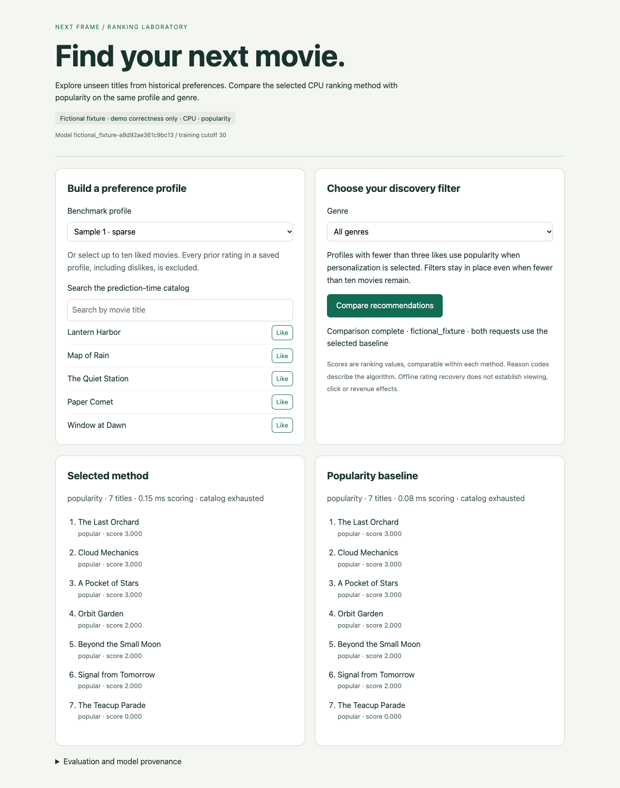

# Recorded fixture walkthrough



[Download the captioned walkthrough](fixture-demo.webm), or open [the local video player](index.html) in a browser. The recording shows saved-profile exclusion, three ephemeral likes, a genre filter, a popularity comparison and model provenance. It uses fictional titles and makes no real-data personalization claim. [Verification](verification.json) records browser/model/source identities, desktop/mobile checks and asset hashes.

The overlay supplies captions; the recording has no audio. For an interview, use this narration:

1. “This is a CPU recommendation API. These titles are fictional and demonstrate correctness.”
2. “Saved profiles exclude every previous rating, including dislikes.”
3. “New likes and genre filters are request-local. Both lists use the same inputs.”
4. “Popularity remains selected because personalization missed the frozen validation objective. The stronger final result cannot change that decision.”
5. “The real-data report separately measures 5,000 HTTP requests and verifies restart and rollback.”

To reproduce without changing the service dependency lock:

```bash
UV_CACHE_DIR="$PWD/.uv-cache" .bootstrap/bin/uv venv --python .venv/bin/python artifacts/demo-tools
UV_CACHE_DIR="$PWD/.uv-cache" .bootstrap/bin/uv pip install \
  --python artifacts/demo-tools/bin/python playwright==1.63.0
artifacts/demo-tools/bin/python benchmarks/capture_demo.py --channel chrome
```

This uses installed Chrome in a new isolated profile and an owned loopback fixture process. Alternatively install Chromium into an ignored project cache, then omit `--channel chrome`:

```bash
PLAYWRIGHT_BROWSERS_PATH="$PWD/artifacts/browsers" artifacts/demo-tools/bin/python -m playwright install chromium
PLAYWRIGHT_BROWSERS_PATH="$PWD/artifacts/browsers" artifacts/demo-tools/bin/python benchmarks/capture_demo.py
```

Setup explicitly downloads browser tools. Runtime capture uses the local fixture API; it does not load movie artwork or third-party assets. Run it separately from performance measurement. The screenshots and video can be attached to the GitHub release; opening GitHub's raw HTML is not a hosted interactive demo.
